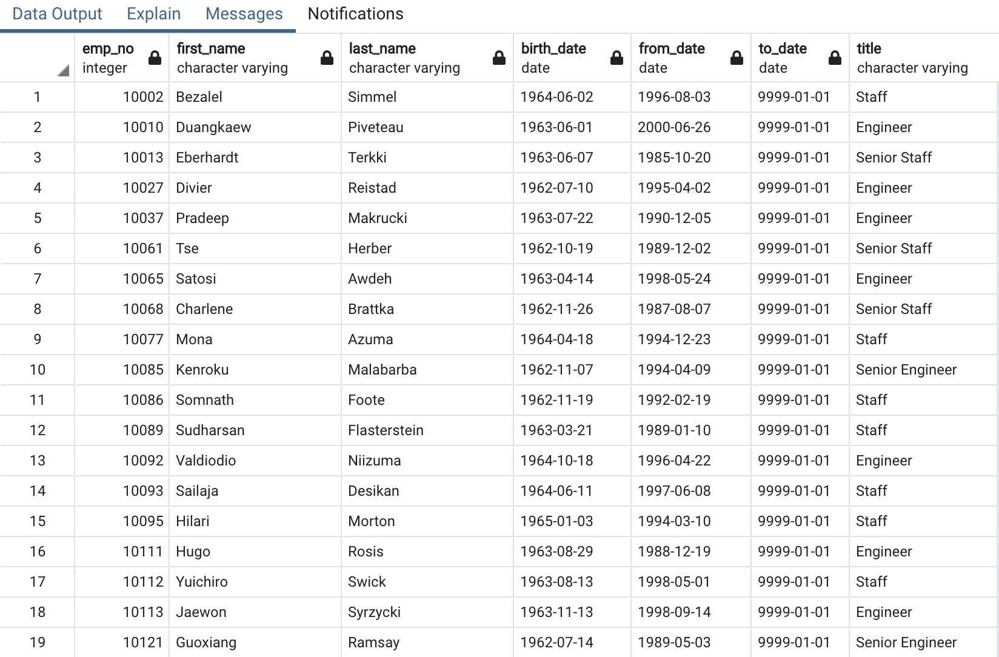

# Pewlett-Hackard-Analysis

## Overview of the Analysis:

Determine the number of retiring employees per title, and identify employees who are eligible to participate in a mentorship program. Then, you’ll write a report that summarizes your analysis and helps prepare Bobby’s manager for the “silver tsunami” as many current employees reach retirement age.

### Purpose:

create a Retirement Titles table that holds all the titles of employees who were born between January 1, 1952 and December 31, 1955. Because some employees may have multiple titles in the database—for example, due to promotions. Create a table that contains the most recent title of each employee. Create a table that has the number of retirement-age employees by most recent job title, and exclude those employees who have already left the company.

## Resources

**Data Source:** CSV.

**Software:** pgAdmin4, SQL.

## Results:

-The Number of Retiring Employees by Title:

  The names of those born between 1952 and 1955 gives a total of 133,776 lines. 
  The list has to be further filtered to remove duplicate entities that have changed titles over the years.
  
-Retirement status:
  After conducting the analysis it was found that there is currently a large number of employees of retirement age holding senior titles (57,668/90,398 = 64%) with     around 64% of the staff to retire. 
  
-Senior Employees 
  The list of candidates that can qualify to become members of the mentorship program, they can be referenced as "senior" employees. 
  
  
  
-Result Overview
  At the moment at Pewlett Hackard, 64% of their employees are getting ready for retirement or being redirected to their mentorship initiatives, which will mean that they are likely going to need an extensive hiring process in the upcoming years. Since a significant amount of future retirees hold Senior positions the mentorship program should provide a capacitation buffer for the extensive expertise that will be leaving the company in the years to come. 
  

## Summary:

-How many roles will need to be filled as the "silver tsunami" begins to make an impact?

  The "silver tsunami" poses a major threat to Pewlett Hackard's future. 30.1%, or 90,398 employees, will need to be replaced. The problem is made more difficult by the fact that there are 45,397 engineers in the organization, accounting for 50.2% of all retirees. Another key segment of the labor force that is retiring is the Senior Staff. There are a total of 28,254 departing workers, accounting for 31.3% of the total. 
  
-Are there enough qualified, retirement-ready employees in the departments to mentor the next generation of Pewlett Hackard employees?

  The total number of people who have been chosen for the job of trainer is 1,549 people. There are 90,398 people who are retiring. Dividing 90,398 / 1,549 people who want to be trainers = 59 people per trainer. In order for the training program to be effective, the company will need to increase at least tenfold the number of people who could become trainers, so that each trainer has only 6 trainees under supervision.
  

